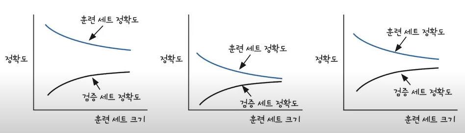
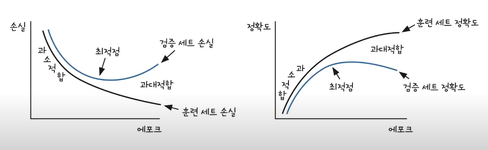
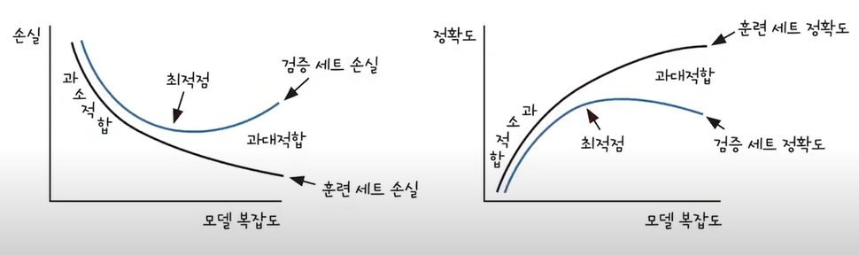

# 1장 인공지능
인공지능 - 머신러닝 - 딥러닝

## 머신 러닝은 기계학습
스스로 규칙을 수정

### 지도 학습
입력과 타깃으로 모델을 훈련

### 비지도 학습
타깃이 없는 데이터를 사용<br>
대표적으로 군집이 있다.

### 강화 학습
주어진 환경으로부터 피드백을 받아 훈련

## 딥러닝
머신러닝 알고리즘 중 하나인 인공신경망으로 만든 것

### 딥러닝은 머신러닝이 처리하기 어려운 데이터를 더 잘 처리한다.

딥러닝 : 이미지, 음성, 텍스트

머신러닝 : 데이터베이스, 엑셀, 레코드 파일

# 2장 딥러닝 도구
## 넘파이
다차원 배열을 다루기 위해 사용한다. 기본 배열 보다 성능이 좋다
## 맷플롯립
그래프 패키지

---

# 3장 머신러닝 기초
선형 회귀는 기울기와 절편을 찾아준다.

## 01. 데이터 준비하기

diabetes.data[:, 0]    # 첫 번째 열만 가져옴 (모든 행, 0번 열)

diabetes.data[0, :]    # 첫 번째 행만 가져옴 (0번 행, 모든 열)

diabetes.data[:,]      # 모든 행, 모든 열 == diabetes.data

## 02. 경사 하강법
데이터와 타깃 데이터를 통해 기울기와 절편을 찾는 것이 선형 회귀의 목표다.

경사 하강법은 기울기(변화율)를 사용하여 모델을 조금씩 조정하는 최적화 알고리즘이다.

문제점
1. y_hat이 y에 한참 미치지 못할 때 , w b를 대폭 수정 못한다.
2. y_hat이 y보다 커지면 y_hat을 감소시키지 못 한다.

### 오차 역전파로 가중치와 절편을 더 적절하게 업데이트
오차가 연이어 전파되는 모습으로 수행된다.

1. 오차와 변화율을 곱하여 가중치 업데이트
2. 두 번째 샘플을 사용하여 가중치 업데이트
3. 전체 샘플 반복
4. 과정 3을 통해 얻어낸 모델을 확인
5. 여러 에포크를 반복하기

## 03. 손실 함수와 경사 하강법의 관계
경사 하강법 : 어떤 손실 함수가 정의되었을 때 손실 함수의 값이 최소가 되는 지점

손실 함수 : 예상한 값과 실제 타깃값의 차이를 함수로 정의한 것

앞에서 사용했던 '오차를 변화율에 곱하여 가중치와 절편 업데이트 하기'는 '제곱 오차'라는 손실 함수를 미분
한 것과 같다.

변화율은 인공지능 분야에서 특별히 그레이디언트(경사)라고 부른다.

## 04. 선형 회귀를 위한 뉴런을 만듭니다.
### 정방향 계산
예측값을 구한다.
### 역방향 계산
예측값 - 결과값의 음수, 곧 미분한것의 음수

오차가 역전파됩니다.

손실함수를 미분하여 w,b를 구해 최적을 구하는 거다.

---

# 4장 분류하는 뉴런 - 이진 분류

## 01. 로지스틱 회귀
### 퍼셉트론
1957년에 이진 분류 문제에서 최적의 가중치를 학습하는 퍼셉트론알고리즘 발표

선형 회귀와 유사한 구조지만 샘플을 이진 분류하기 위하여 계단 함수라는 것을 사용합니다.

계단 함수를 통과한 값을 다시 가중치와 절편을 업데이트하는데 사용한다.

선형함수 : wx1 + wx2 + b = z

### 아달린
1960년에 퍼셉트론을 개선한 적응형 선형 뉴런을 발표 -> 아달린

선형 함수의 결과를 학습에 사용한다. 게단 함수의 결과는 예측에만 활용한다.

### 로지스틱 회귀
아달린에서 조금 더 발전한 형태

선형 함수를 통과시켜 얻은 z를 임계 함수에 보내기 전에 변형시키는데, 바로 <br>
이런 함수를 활성화 함수라고 부른다.

활성화 함수를 통과한 값 a라고 하자

활성화 함수는 모델에 비선형성을 부여하여, 단순한 선형 모델이 풀 수 없는 복잡한 문제도 해결할 수 있게 해줍니다.

마지막 단계에서 임계 함수를 사용하여 예측을 수행한다.

**임계함수는 계단함수의 일종**

#### - 활성화 함수는 비선형 함수를 사용한다.
선형 함수를 사용하면 임계 함수앞에 뉴런을 여러 개 쌓아도 결국 선형 함수일 것이므로 의미가 없기 때문이다.

로지스틱 회귀의 활성화 함수는 '시그모이드 함수'이다.

## 02. 시그모이드 함수로 확률을 만듭니다.
선형 함수 z -> 활성화 함수 a -> 임계함수 예측값

시그모이드 함수는 z를 0~1 사이의 확률값으로 변환 시켜주는 역할을 한다.

### 시그모이드 함수가 만들어지는 과정
오즈 비 > 로짓 함수 > 시그모이드 함수

오즈 비: 성공 확률과 실패 확률의 비율을 나타내는 통계이다.

로짓 함수: 오즈 비에 로그 함수를 취한것

로지스틱 함수: 시그모이드 함수, 확률 p가 y축으로 정리한것, z에 대해서 정리

## 03. 로지스틱 손실 함수를 경사 하강법에 적용
로지스틱 손실 함수는 다중 분류를 위한 손실 함수인 크로스 엔트로피 손실함수를 이진 분류 버전으로 만든 것이다.

로지스틱 손실 함수 미분한 것은 제곱 오차의 미분과 비슷하다.

**로지스틱 손실 함수의 미분을 통해 로지스틱 손실 함수의 값을 최소로 하는
가중치와 절편을 찾아야 한다**

### 로지스틱 손실 함수와 연쇄 법칙
로지스틱 손실 함수를 a에 대하여 미분

a를 z에 대하여 미분

z를 w에 대하여 미분

결과적으로 로지스틱 손실 함수를 w에 대하여 미분하기

### 가중치 업데이트 방법
로지스틱 손실함수를 가중치에 미분한 식을 가중치에서 뺀다.

### 절편 업데이트 방법
위와 마찬가지로 연쇄 법칙을사용하여 절편을 업데이트 한다.

## 04. 분류용 데이터 세트
이진 분류문제에서는 해결해야 할 목표를 양성 샘플이라고 부른다.

악성종양을 찾는 것이면 악성 종양이 양성 샘플이고 양성 종양이 음성 샘플이다.

## 06. 로지스틱 회귀 뉴런으로 단일층 신경망을 만듭니다.
### 일반적인 신경망
입력층 - 은닉층 - 출력층 - 활성화 함수

### 여러 가지 경사 하강법
1. 확률적 경사 하강법
2. 배치 경사 하강법
3. 미니 배치 경사 하강법

1,2의 장점을 절충한것이 3번이다.

미니 배치 경사 하강법은 확률적 경사 하강법보다는 매끄럽고 배치 경사 하강법보다는 덜 매끄러운 그래프가
그려진다.

미니 배치는 무작위로 데이터를 선택해 편향을 줄이고, 반복 학습을 통해 전체 데이터의 특성을 반영하므로 속도와 안정성 모두를 갖춘 학습 방식입니다.

# 5장 훈련 노하우
## 01. 검증 세트를 나누고 전처리 과정
### 테스트 세트로 모델을 튜닝
#### 로지스틱 회귀로 모델 훈련하고 평가
사이킷런의 SGDClassifier 클래스를 이용하여 로지스틱 회귀 문제에 경사 하강법을 적용

loss의 매개변수의 값을 하이퍼파라미터라고 부른다.

약 83%의 성능
#### 서포트 벡터 머신으로 훈련하고 평가
성능이 93%가 나왔다.

모델을 튜닝하여 성능을 올렸다.

### 테스트 세트로 모델을 튜닝하면 실전에서 좋은 성능을 기대하기 어렵다.
테스트 세트로 튜닝을 하면 테스트 세트에 대해서만 좋은 성능을 보여주는 모델이 만들어진다.

이것을 모델의 일반화 성능이 왜곡이다.

### 검증 세트를 준비
모델 튜닝을 위한 세트는 따로 준비한다. 검증 세트와 테스트 세트를 구분합니다.

일반적으로 10만개 정도는 훈련세트 : 검증 : 테스트 = 8 : 1 : 1


### 데이터 전처리와 특성의 스케일을 알아봅니다.
대부분 실전에서는 데이터 전처리가 필요하다.

#### 특성의 스케일은 알고리즘에 영향을 준다.
스케일 : 어떤 특성이 가지고 있는 값의 범위

경사 하강법은 스케일에 민감한 알고리즘으로 특성의 스케일을 맞추는 전처리를 해줘야 한다.

### 스케일을 조정하지 않고 모델을 훈련
#### 1. 데이터 준비
스케일이 다른 두 특성에 경사 하강법 알고리즘을 적용한 가중치가 어떻게 변할까?

#### 2. 가중치를 기록할 변수와 학습을 파라미터 추가하기
학습률을 추가하여 가중치의 업데이트 양을 조절한다.

손실 함수는 복잡한 굴곡을 가진 다차원 공간의 초평면으로 만약 가중치를 큰 폭으로 업데이트하면 전역 최솟값을 지나쳐
최적의 해를 구할 수 없게 된다.

적절히 학습률을 조절하여 '손실 함수의 표면을 천천히 이동하며 전역 최솟값을 찾는다.'

보통 0.001, 0.01 등의 로그 스케일로 학습률을 지정하여 테스트한다.

#### 3. 가중치 기록하고 업데이트 양 조절하기
fit() 메서드에서 가중치가 바뀔 때마다 w_history 리스트에 가중치를 기록

w_grad에 학습률 self.lr를 곱하는 연산 추가되어 가중치 업데이트 양 조절

#### 4. 모델 훈련 평가
.shape는 (행 개수, 열 개수)의 튜플이다.

shape[1]은 열 개수이다. 곧 특성의 개수를 뜻한다.

훈련 세트 조정하지 않고 하니까 91%의 성능

#### 5. 스케일을 조정한 훈련 세트를 사용하여 모델 훈련
np.mean(x_val, axis=0) 는 각 열의 평균

```python
import numpy as np

x_val = np.array([
    [1, 2, 3],
    [4, 5, 6],
    [7, 8, 9]
])

mean_col = np.mean(x_val, axis=0)
print(mean_col)

```


### 스케일을 조정해 모델 훈련
스케일 조정 방법 중 하나는 표준화다.

표준화 = 특성값에서 평균을 빼고 표준 편차로 나눈면 된다.

#### 3. 모델 성능 평가
0.37이 나왔다.

훈련 세트와 검증 세트의 스케일을 같이 바꿔줘야 성능이 나온다.

```python
train_mean = np.mean(x_train, axis=0)
train_std = np.std(x_train, axis=0)
x_train_scaled = (x_train = train_mean) / train_std
```
### 스케일을 조정한 다음에 실수하기 쉬운 함정
훈련 세트와 검증 세트는 같은 비율로 전처리 해야된다.

훈련 세트의 평균, 표준 편차를 사용하여 검증 세트를 반환하면 된다.

## 02. 과대적합과 과소적합
과대적합 : 모델이 훈련 세트에서는 좋은 성능을 내지만 검증 세트에서는 낮은 성능을 내는 경우

과소적합 : 훈련 세트와 검증 세트의 성능에는 차이가 없지만 모두 낮은 성능을 내는 경우

### 훈련 세트의 크기와 과대적합, 과소적합 분석하기

과대 적합된 모델을 **분산이 크다**라고 한다.

과대 적합의 주요 원인 중 하나는 훈련 세트에 충분히 다양한 패턴의 샘플이 포함되지 않은 경우이다.

이런 경우에는 더 많은 훈련 샘플을 모아 검증 세트의 성능을 향상 시킬 수 있다.

현실적으로 모을 수 없는 경우, 모델이 훈련 세트에 집착하지 않도록 가중치를 제한할 수 있다.

이를, 모델의 복잡도를 낮춘다.라고 한다.

과소적합된 모델을 **편향이 크다**라고 한다.

과소적합은 모델이 충분히 복잡하지 않아 훈련 데이터에 있는 패턴을 모두 잡아내지 못하는 현상이다.

해결 방법은 더 높은 모델을 사용하거나 가중치의 규제를 완화하는 것이다.

### 에포크와 손실 함수의 그래프로 과대적합과 과소적합 분석

훈련세트의 손실은 에포크가 증가함에 따라 손실이 줄어드는 이유는 모델이 훈련 세트에 밀착하기 때문이다.
즉, 모델이 과대적합되기 시작한다.

최적점 이전에는 훈련 세트와 검증 세트의 손실이 비슷한 간격을 유지하는데, 이 영역에서 학습을 중지하면 과소적합이 된다.
### 모델 복잡도와 손실 함수의 그래프로 과대적합과 과소적합 분석

모델 복잡도란 모델이 가진 학습 가능한 가중치 개수를 말한다.

무조건 복잡하다고 좋은 것이 아니라 최적점을 찾아서 적당한 복잡도를 찾아야 한다.

### 적절한 편향-분산 트레이드오프를 선택합니다.
과소적합된 모델은 '편향되었다' 과대적합된 모델은 '분산이 크다'라고 한다.

이 모델 사이의 관계를 편향-분산 트레이드오프라고 한다.

편향을 줄이면 분산이 커지고 분산을 줄이면 편향이 커지는 것을 말하는데 분산이나 편향이 적절한 중간 지점을
선택해야한다.

### 001 검증 손실 기록하기 위한 변수 추가
### 002 fit() 메서드에 검증 세트를 전달받을 수 있도록 x_val, y_val 매개변수 추가
### 003 검증 손실 계산하기
훈련 세트의 손실을 계산하는 방식과 동일하다.

검증 세트 샘플을 정바향으로 계산한 다음 활성화 함수를 통과 시켜 출력 값을 계산

이 값을 사용하여 로지스틱 손실 함수의 값을 계산해서 val_losses 리스트에 추가

에포크 마다 update_val_loss() 메서드를 호출


## 03. 규제 방법을 배우고 단일층 신경망에 적용

## 04. 교차 검증을 알아보고 사이킷런으로 수행
