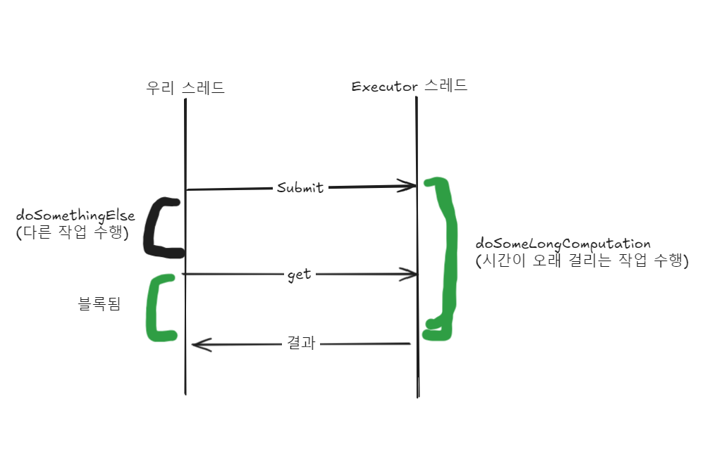
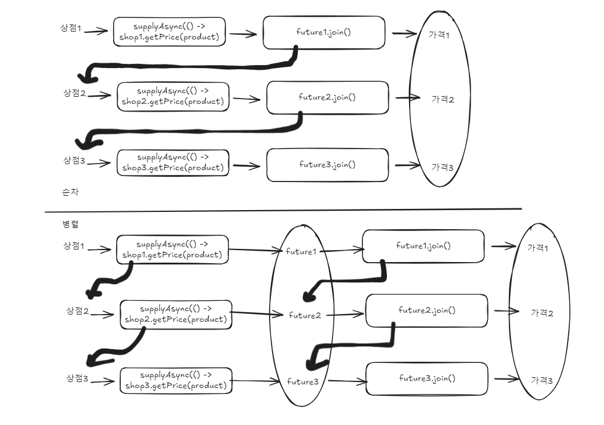
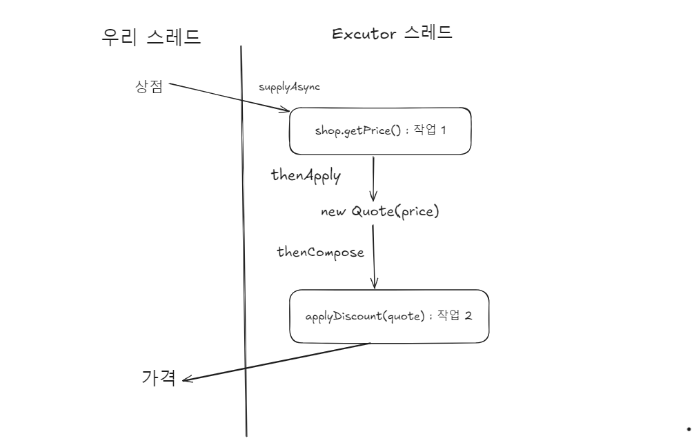
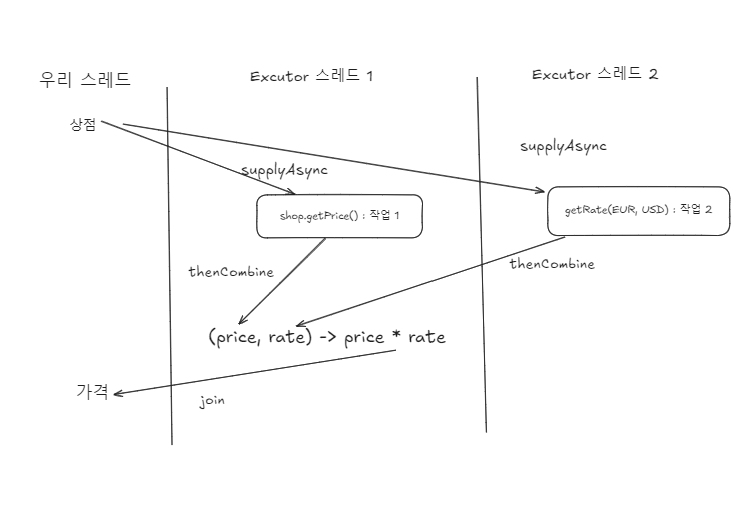

# 15장 CompletableFuture와 리액티브 프로그래밍 컨셉의 기초

## 15.1.2 Executor와 스레드 풀
자바 5는 Executor 프레임워크와 스레드 풀을 통해 스레드의 힘을 높은 수준으로 끌어올리는 즉 자바
프로그래머가 태스크 제출과 실행을 분리할 수 있는 기능을 제공

### 스레드의 문제
자바 스레드는 직접 운영체제 스레드에 접근한다.

운영 체제 스레드를 생성 종려하는데 비싼 비용이 든다.

운영 체제가 지원하는 스레드 수를 초과해서 사용하면 자바 애플리케이션이 크래시 될 수 있다.

### 스레드 풀이 더 좋은 이유
ExecutorService는 태스크를 제출하고 나중에 결과를 수집할 수 있는 인터페이스를 제공한다.

제출된 태스크를 먼저 온 순서대로 실행한다. 이 방식의 장점은 하드웨어의 맞는 수의 태스크를 유지 하면서 수 천개의 태스크를 
스레드 풀에 아무 오버헤드 없이 제출할 수 있다는 장점이 있다.

프로그래머는 태스크(Runnable, Callable)를 제공하면 스레드가 이를 실행

### 스레드 풀이 나쁜 이유
- I/O를 기다리는 등의 블로킹 상태의 스레드에 주의 해야한다. 
20개의 태스크, 5개의 스레드 가 있으면 3개가 블로킹 되었다면 2개로 15개의 태스크를 처리해야한다.
- 중요한 코드를 실행하는 스레드가 죽는 일이 없도록 main이 반환되기전에 모든 스레드의 작업을 종료한다.

# 15.2 동기 그리고 비동기 API

## 15.2.2 리액티브 형식의 API
콜백 형식의 프로그래밍을 이용

리액티브 형식의 API는 보통 한 결과가 아니라 일련의 이벤트에 반응하도록 설계되었으므로 Future를 이용하는 것이 적절하다.

## 15.2.3 잠자기(기타 블로킹 동작)는 해로운 것으로 간주
스레드는 블로킹 시 시스템 자원을 점유한다.

스레드 풀에서 잠을 자는 태스크는 다른 태스크가 시작되지 못하게 막아 자원을 소비한다.

## 비동기 api 와 동시성 api

- 비동기
작업 요청 후 결과를 기다리지 않고 바로 반환함

- 동시성
여러 작업을 동시에 실행할 수 있게 해주는 API

## 15.3 박스와 채널 모델
Future의 get()을 할때 blocking이 일어나는데, 이 작업이 대규모 작업이면 하드웨어의 병렬성을 제대로 활용하기 쉽지 않다.

이를 CompletableFuture와 콤비네이터를 이용해 문제를 해결한다.

## 15.4 CompletableFuture와 콤비네이터를 이용한 동시성
자바 8에서는 Future 인터페이스의 구현인 CompletableFuture를 이용해 Future를 조합할 수 있는 기능을 추가했다.

## 15.5. 발행- 구독 그리고 리액티브 프로그래밍
Future와 CompletableFuture은 독립적 실행과 병령성이라는 정식적 모델에 기반하며 Future는 한 번만 실행해 결과를 제공한다.

반면 리액티브 프로그래밍은 시간이 흐르면서 Future 같은 객체를 통해 여러 결과를 제공한다.

예시) <br>
온도계 객체(매 초마다 온도 값을 반복적으로 제공), 리스너 객체(Http 요청을 기다렸다가 이후에 결과를 생산)

이 두 객체를 처리하는 객체  하나가 있다.

자바 9에서는 Flow의 인터페스에 발행-구독 모델을 적용해 리액티브 프로그래밍을 제공한다.
- 구독자가 구독할 수 있는 발행자
- 이 연결을 구독이라 한다.
- 이 연결을 이용해 메시지를 전송한다.

> '<? super T>' 는 쓰기 일때 값을 외부로부터 넣을 때 (Consumer), 
>
> '<? extends T>' 읽기 전용 값을 외부에서 꺼낼 때 (Producer)

onNext는 데이터를 전달하는 용도 업스트림, 다운 스트림

## 역압력

Subscriber 객체를 어떻게 어떻게 Publisher에게 전달해 발행자가 필요한 메서드를 호출할 수 있는지 살펴봤다.


# 16장 CompleatableFuture: 안정적 비동기 프로그래밍
## 16.1 Future의 단순 활용


> 이 시나리오에 문제는 오래 걸리는 작업 끝나지 않으면 우리 스레드가 영원히 끝나지 않는다.
> 
> get 메서드를 오버로드해서 우리 스레드가 대기할 최대 타임아웃 시간을 설정해야 한다.


## 16.1.1 Future 제한
두 개의 비동기 계산 결과를 하나로 합칠때 두 가지 작업은 독립적이지만

두 번째 결과가 첫 번째 결과에 의존하는 상황일 수 있다.

## 16.1.2 CompletableFuture로 비동기 애플리케이션 만들기
동기 API를 사용하는 상황을 블록 호출, 비동기 API를 사용하는 상황을 비블록 호출이라고 한다.

## 예외 처리 
- Future는 명시적으로 완료 상태를 알려줘야 함
- 예외가 발생해도 자동으로 완료되지 않음
- 개발자가 예외 처리 방식을 직접 제어할 수 있게 함

completeExceptionally()는 "이 Future가 예외로 인해 완료되었다"고 알려주는 신호.

## 팩토리 메서드 supplyAsync로 CompletableFuture 만들기
supplyAsync메서드는 Supplier를 인수로 받아서 ComletableFuture를 반환한다.

ForkJoinPool의 Executor 중 하나가 Supplier를 실행한다. 두 번째 인수로 다른 Executor를 지정할 수 있다.

## 16.3 블록 코드 만들기
네 개의 상점에 순차적으로 실행하면 4초 이상이 걸린다.

## 16.3.1 병렬 스트림으로 요청 병렬화하기
병렬 실행시 1초 . 028이 걸린다.

```java
 public static List<String> findPrice(String product){
//        return shops.stream()
//                .map(shop -> String.format("%s price is %.2f",
//                        shop.getName(), shop.getPrice(product)))
//                .toList();

    return shops.parallelStream()
            .map(shop -> String.format("%s price is %.2f",
                    shop.getName(), shop.getPrice(product)))
            .toList();

}
```
> [BestPrice price is 136.37, LetsSaveBig price is 153.97, MyFavoriteShop price is 142.50, BuyItAll price is 227.55]
Done in 1028

## 16.3.2 CompletableFuture로 비동기 호출 구현하기
```java
 List<CompletableFuture<String>> priceFutures = shops.stream()
                .map(shop -> CompletableFuture.supplyAsync(() -> String.format("%s price is %.2f",
                        shop.getName(), shop.getPrice(product))))
                .toList();

        return priceFutures.stream()
                .map(CompletableFuture::join) // 모든 비동기 동작이 끝나길 기다린다.
                .toList();
```
두 map 연산을 하나의 스트림 처리 파이프라인으로 처리하지 않은 이유는 스트림 연산은 게으른 특성이 있어서 그렇다.


## 16.3.3 더 확장성이 좋은 해결 방법

병렬 스트림과 CompletableFuture는 내부적으로 `Runtime.getRuntime().availableProcessors()`가 반환한는 스레드 수를 사용하면서 
비슷한 결과가 된다.

결과는 비슷하지만 CompletableFuture는 병렬 스트림 버전에 비해 작업에 이용할 수 있는 다양한 Executor를 지정이 가능한 장점이 있다.

## 16.3.4. 커스텀 Executor 사용
> 기본 공통 풀 사용 (CompletableFuture 기본)
> 병렬 스트림도 내부적으로 ForkJoinPool 사용
> ForkJoinPool.commonPool()
> 큰 문제를 작은 문제로 나누어서 병렬 처리하는 데 특화된 스레드 풀

커스텀 Executor를 사용하지 않는다면 아래와 같습니다.

문제점들:
- Thread 직접 생성: 매번 새 스레드 생성/제거로 오버헤드 큼
- 기본 풀 사용: 다른 작업들과 스레드 공유해서 성능 영향
- 리소스 제어 어려움: 스레드 수 제한이 없어서 시스템 부하 위험

```java
import java.util.concurrent.Executors;
import java.util.concurrent.ThreadFactory;

private final Executor executor = Executors.newFixedThreadPool(Math.min(shops.size(), 100), new ThreadFactory() {
    @Override
    public Thread newThread(@org.jetbrains.annotations.NotNull Runnable r) {
        Thread t = new Thread(r);
        t.setDaemon(true);
        return t;
    }
});
```
데몬 스레드를 포함하여 일반 스레드가 실행 중이면 자바 프로램이 종료되지 않기 때문에 데몬 스레드와 같이 강제 종료될 수 있는 스레드를 사용한다.


## 16.4 비동기 작업 파이프라인 만들기

shop에서 파싱한것을 Quote클래스로 캡슐화 한다.

## 16.4.2 할인 서비스 사용
```java
public static List<String> findPrices(String product){
        return shops.stream()
                .map(shop -> shop.getPrice(product)) // shop에서 계산한 가격 String
                .map(Quote::parse) // 상점에서 반환된 문자열을 Quote 객체로 변환
                .map(Discount::applyDiscount) // Quote에 할인 적용
                .toList();
    }
```
- 첫 번째 연산에서는 각 상점을 요청한 제품의 가격과 할인 코드로 변환
- 두 번째 연산에서는 이들 문자열을 파싱해서 Quote객체를 만든다.
- 세 번째 연산에서는 원격 Discount 서비스에 접근해서 최종 할인 가격을 계산하고 가격에 대응하는 상점 이름을 포함하는 문자열을 반환한다.

> 이 동작은 5개의 상점을 보는데 상점에 가격 정보를 요청하는데 5초, 할인 코드 적용하는데 5초가 소비되어 10초가 걸린다.

## 16.4.3 동기 작업과 비동기 작업 조합

```java
public static List<String> findPrice(String product) {
        List<CompletableFuture<String>> priceFutures = shops.stream()
                .map(shop -> CompletableFuture.supplyAsync(
                        () -> shop.getPrice(product), executor)) // shop에서 계산한 가격 String
                .map(future -> future.thenApply(Quote::parse)) // 상점에서 반환된 문자열을 Quote 객체로 변환
                .map(future -> future.thenCompose(quote ->
                        CompletableFuture.supplyAsync(
                                () -> Discount.applyDiscount(quote), executor))) // Quote에 할인 적용
                .toList();

        return priceFutures.stream()
                .map(CompletableFuture::join)
                .toList();
    }
```



## CompletableFuture를 조합해서 할인된 가격 계산
두개의 비동기 동작을 만들 수 있다.
- 상점에서 가격 정보를 얻어와서 Quote로 변환
- 변환된 Quote를 Discount 서비스로 전달해서 할인된 최종가격 흭득


> thenCompose는 첫 번째 연산의 결과를 두 번째 연산으로 전달한다. 
> thenComposeAsync를 사용하지 않은 이유는 두 번째 결과는 첫 번째 결과에 의존하므로 thenCompose를 사용했다.

| 메서드                  | 실행 방식                    | 언제 쓰나         |
| -------------------- | ------------------------ | ------------- |
| `thenCompose()`      | 이전 작업과 같은 스레드에서 실행될 수 있음 | 빠르고 간단한 로직    |
| `thenComposeAsync()` | 항상 비동기 실행됨 (다른 스레드에서 실행) | 작업 분리, 병렬성 확보 |

## 16.4.4 독립 CompletableFuture와 비독립 CompletableFuture 합치기
> 실전에서는 독립적으로 실행된 두 개의 CompletableFuture 결과를 합쳐야 하는 상황이 발생한다.
> 첫 번째와 상관없이 두 번째를 실행 할 수 있어야한다.

```java
import java.util.concurrent.CompletableFuture;

Future<Double> futurePriceInUSD =
        CompletableFuture.supplyAsync(() -> shop.getPrice(product))
                .thenCombine(
                        CompletableFuture.supplyAsync(
                                () -> exchangeService.getRate(Money.EUR, Money.USD)), 
                        (price, rate) -> price * rate
                );
```




## 16.4.6 타임아웃 효과적으로 사용하기
Future의 계산 결과를 읽을 때는 무한정 기다리는 상황이 발생할 수 있어서

블록을 하지 않는 것이 좋다.

### orTimeout
지정된 시간이 지난 후에 CompletableFuture를 TimeoutException으로 완료하면서 또 다른

CompletableFuture를 반환할 수 있도록 ScheduledThreadExecutor를 활용한다.

### completeOnTimeout
orTimeout 메서드처럼 CF를 반환하고, 타임 아웃 발생하면 미리 지정된 값을 사용한다.

```java
import java.util.concurrent.CompletableFuture;
import java.util.concurrent.TimeUnit;

Future<Double> futurePriceInUSD =
        CompletableFuture.supplyAsync(() -> shop.getPrice(product))
                .thenCombine(
                        CompletableFuture.supplyAsync(
                                () -> exchangeService.getRate(Money.EUR, Money.USD))
                                .completeOnTimeout(DEFAULT_RAE, 1, TimeUnit.SECONDS),
                        (price, rate) -> price * rate
                )
                .orTimeout(3, TimeUnit.SECONDS);
```

> 다음에는 모든 검색 결과가 완료될 때까지 사용자를 기다리게 하지 말고, 이용할 수 있는 가격정보는
> 즉시 사용자에게 보여줄 수 있게 제공하는 방법을 알아보겠다.

## 16.5 CF의 종료에 대응하는 방법
thenAccept라는 메서드를 사용해서 구현해보자.

thenAccept()는 각 작업이 완료되는 즉시 후속 처리를 실행할 수 있어서,

join()처럼 모든 작업이 끝날 때까지 기다렸다가 한 번에 처리하는 것보다 빠르게 반응할 수 있습니다.

하나라도 느리면 전체가 지연됨 -> 해결하려면 thenAccept로 바로바로 결과를 소비함

